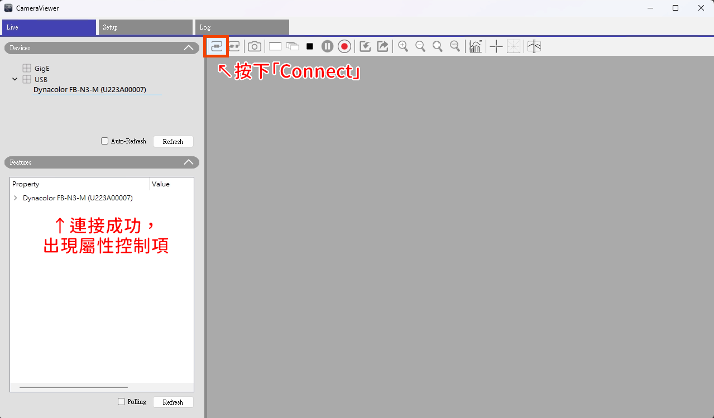
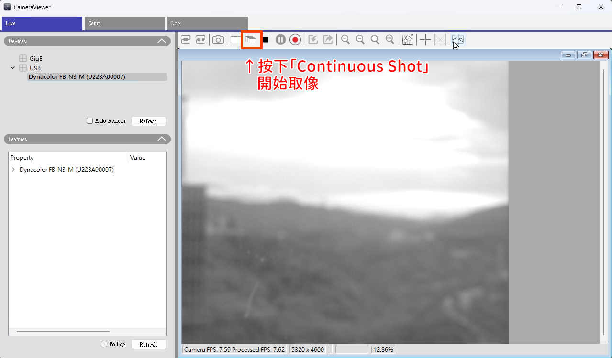
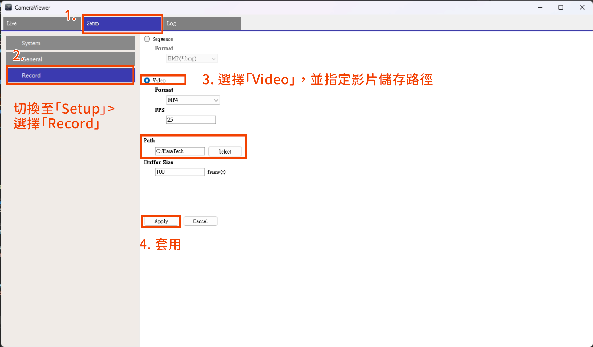
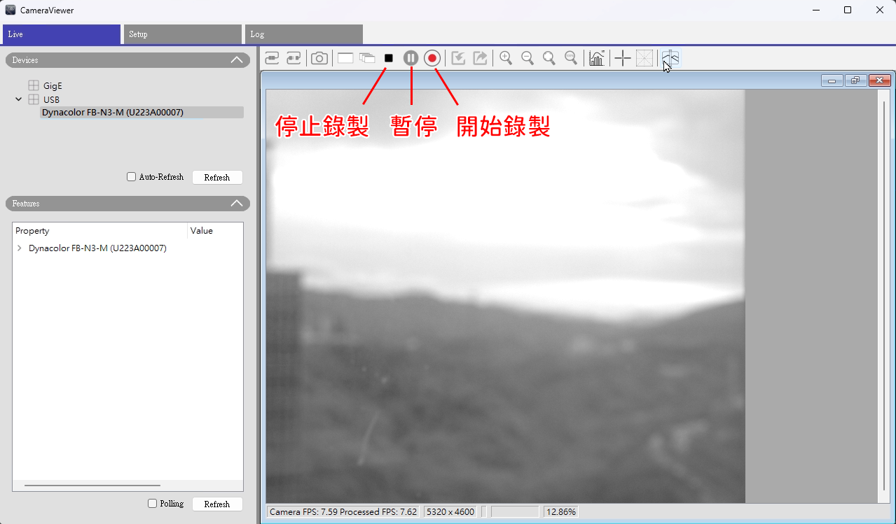
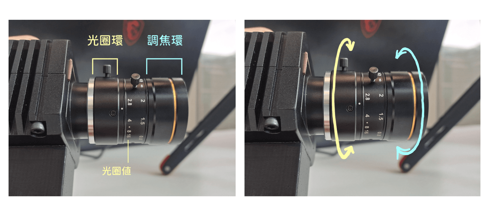
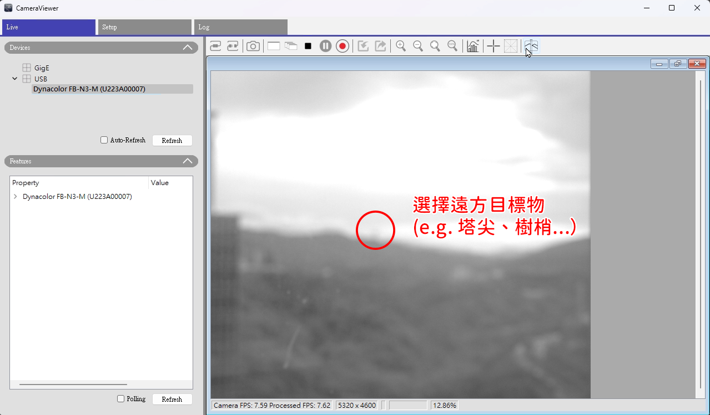
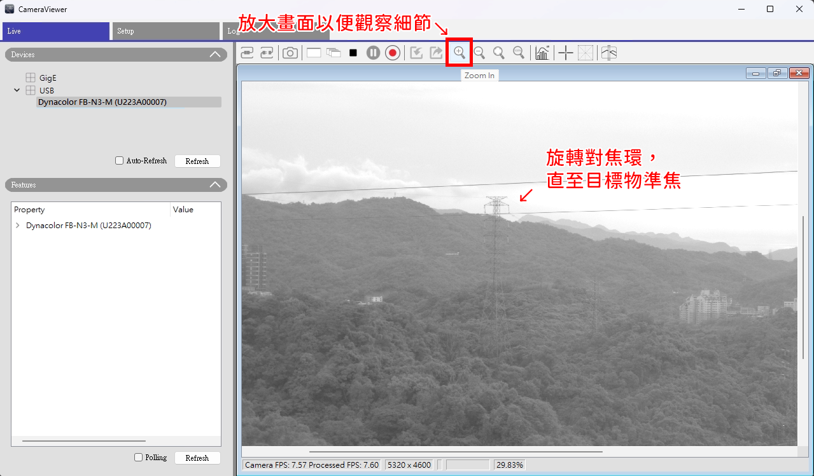

# **小目標辨識素材錄製操作說明**
## **1. 設備清單與連接說明**
### **1.1 設備清單**
- 工業相機（Dynacolor FE-N3-M）
- 手動調焦鏡頭
- USB 3.0 Type A / Micro B 連接線
- 相機檢視軟體 CameraViewer
- 相機驅動程式

### **1.2 連接步驟**
- 透過連接線將相機鏡頭組連接至電腦
- 確保電腦已開啟

## **2. 相機檢視軟體 CameraViewer 操作**
### **2.1 相機連線與啟動**
1. 開啟 CameraViewer。
2. 軟體會自動偵測相機，並顯示於「Device」欄位下（若未偵測到，可按 *Refresh*。）

    

 

3. 按下 **「Connect」** 連上相機，連上之後相機名稱會變成粗體，並於「Features」欄位出現屬性控制項。
4. 按下 **「Continuous Shot」** 開始連續取像。
> **⚠️** **_注意：_**  *此時僅是在進行影像串流，* **_還不是在錄影！_** 有關錄製及存檔的操作，詳見 **2.2** 。

    

 

### **2.2 存檔設定與錄影**
1. 開始錄製前請設好存檔路徑。切換至 **「Setup」 > 「Record」**
2. 選擇 **「Video」**，並指定影片存檔路徑。選擇 **「Apply」** 套用。

    

 

3. 切回「Live」，由上方按鈕 **開始／停止／暫停錄製**。

    

 

### **2.3 參數調整**
[待補充]

## **3. 手動調焦基本操作**
### **3.1 基礎調焦概念**
- **調焦環**：調整焦點，使物體成像清晰。
- **光圈環**：控制進光量。
    - **光圈值（F-stop）**：數值越小，光圈越大，進光量越多。

    
    <figcaption>（左）調焦環與光圈環示意圖。（右）手動旋轉以調整焦距及光圈。</figcaption>

 

### **3.2 具體調焦步驟**
1. 打開 Camera Viewer 軟體並開始取像。
2. 將相機指向遠方目標（e.g. 塔尖、樹梢），並 **將預覽畫面放大** ，以便觀察細節。
> **ℹ️** **NOTE：** 因為我們的目的是蒐集 10 海里進場的廣角畫面資料，以提供 AI 訓練用，故要找尋遠處的物體來對焦，以確保拍到的飛機是準焦的。
3. 慢慢轉動鏡頭上的 **調焦環**，同時觀察軟體預覽畫面。
4. 當目標物體邊緣最銳利、最清晰時，即表示對焦完成。

    
    

 

## **4. 小目標 AI 訓練素材收集原則**
### **4.1 影像品質要求**
- **清晰度**：確保目標物體在畫面中清晰、沒有模糊。
- **避免過曝或過暗**：確保按下 **「Automatic Image Adjustment」**，以使畫面細節能最大程度被保留。

### **4.2 多樣性是關鍵**
- **多變的環境光線**：在晴天、陰天、微霧、順光逆光（上午及下午）等不同光線條件下拍攝。

[待補充]

## 5. **常見問題與解決辦法**
### **5.1 畫面模糊**
- **原因：** 調焦不準確，或未設 Automatic Image Adjustment 以致曝光時間過長。
- **解決：** 重新調焦，或按下 Automatic Image Adjustment。
 
### **5.2 畫面過亮或過暗**
- **原因：** 曝光時間或增益設定不當。
- **解決：** 使用 Automatic Image Adjustment 使軟體自動操縱相機曝光及增益。
    
### **5.3 找不到相機**
- **原因：** 連接線鬆動或驅動程式問題。
- **解決：** 檢查連接線，或聯繫工程師重新安裝驅動程式。
